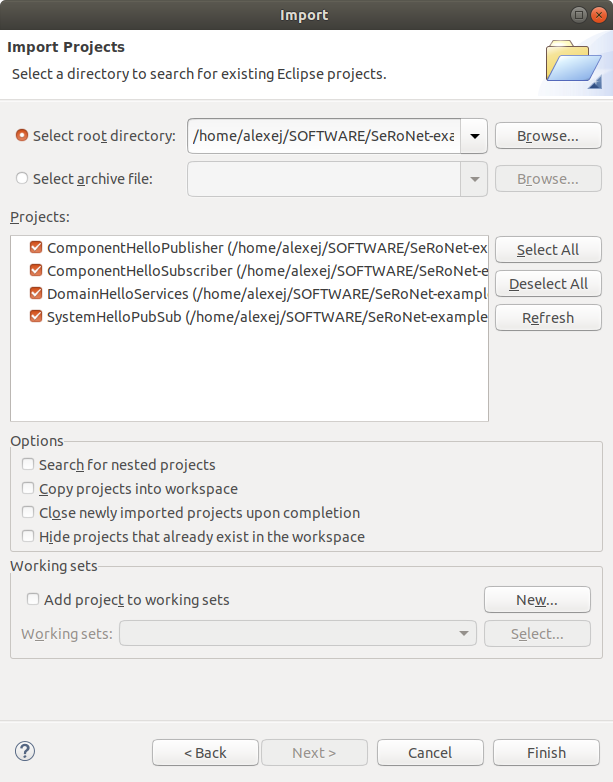
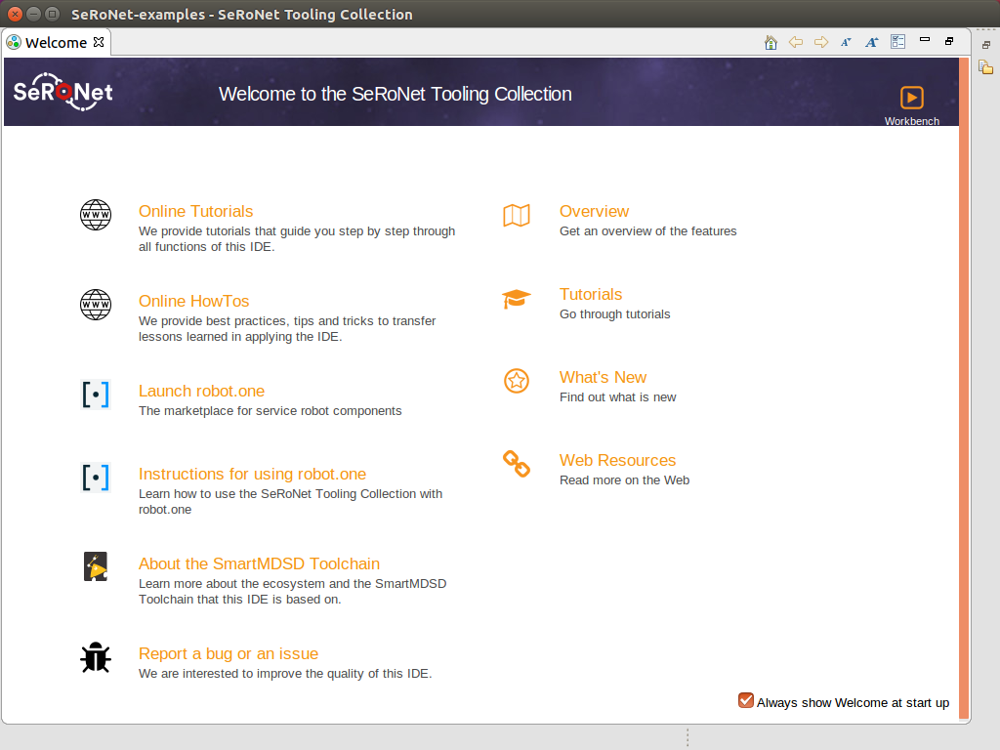
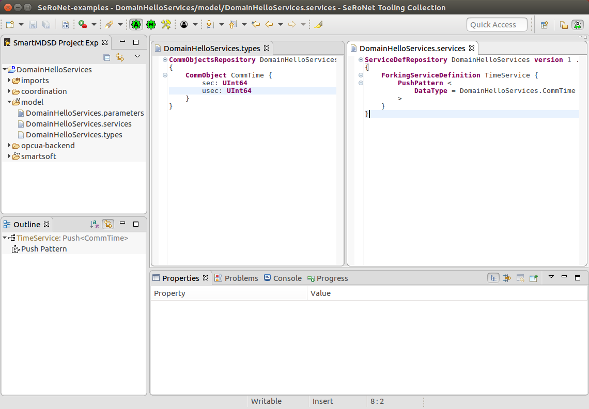
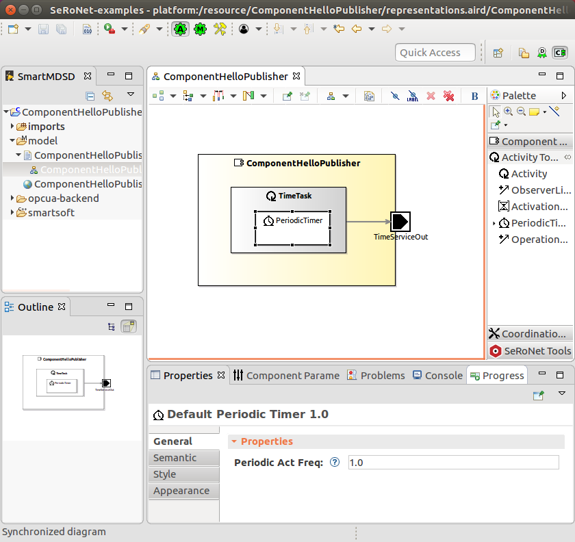
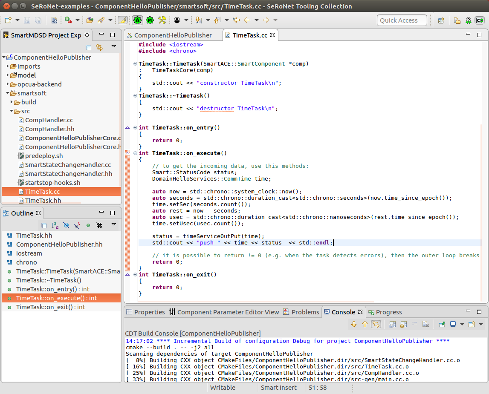
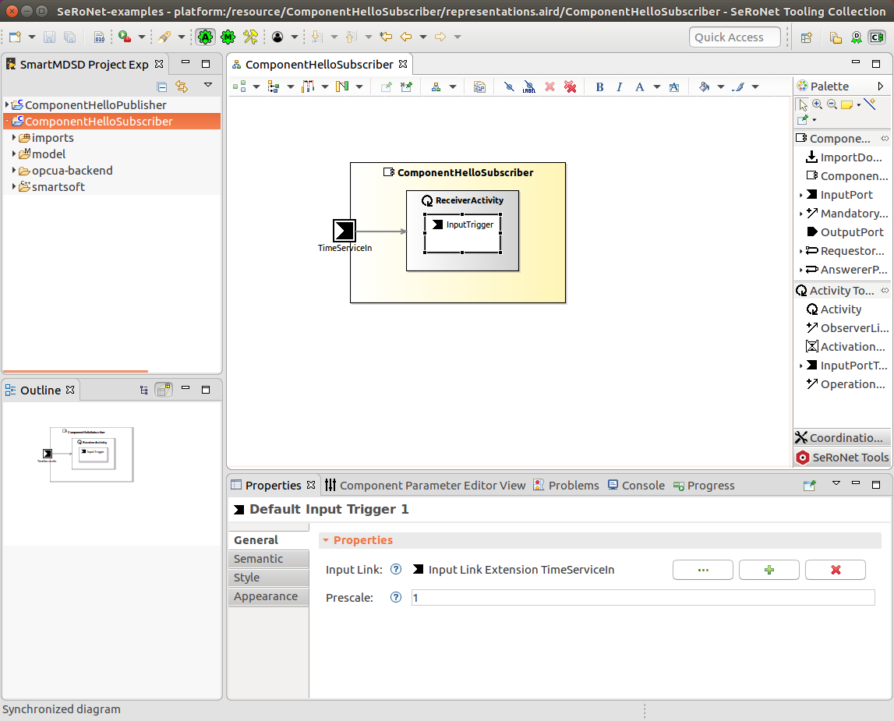
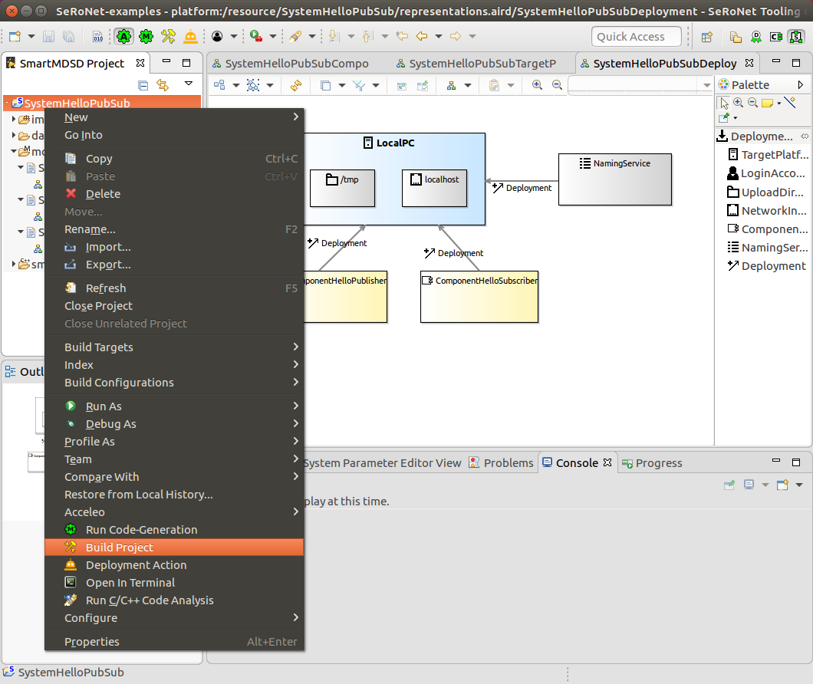
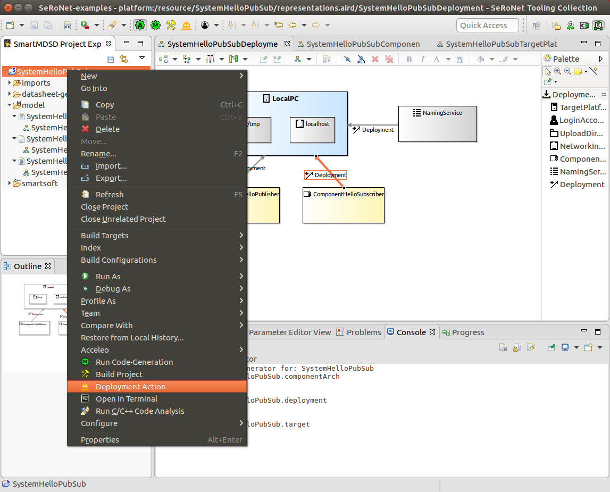

# SeRoNet Tooling Collection - Hello World Example

This folder consist of very simple hello world examples that demonstrate the most
basic overall development workflow, starting from scratch with an empty workspace
and showing all the intermediate steps until a system consisting of two new components is deployed and executed at the target platform.

The goal of this example is to get familiar with the basic menus and basic tooling
features. For further workflow use-cases and examples, please read [the online tutorials](https://wiki.servicerobotik-ulm.de/tutorials:start).

For a fast-track overview of the individual key-steps, please see the series of screenshots located in the sub-folder [Screenshots](Screenshots/). At the end you should get a new system consisting of two newly created components as shown in the following screenshot:


If you just want to try out the hello-world components without creating them by yourself, you can simply clone this repository and import the provided components into your workspace. To do so, use the Eclipse menu **File** => **Import** => **General** => **Existing Projects into Workspace** and click the **Next** button. In the following window, click the **Browse...** button and select your local folder where you cloned the examples repository. Your window should look like the following screenshot:



Click **Finish** to finally import the selected projects. After that, you can directly build, deploy and execute the system as shown in the screenshots **25-27** (please note, in order to see the **Deployment Action**, you will need to activate the **System Builder Perspective** as shown in screenshot **17**).

However, we recommend you to try creating the components by yourself (as explained next) to experience all the basic features of the tooling first hand.


## Step-by-Step Tutorial for Creating the Hello World Projects

In this tutorial we will create the following four basic projects:

1. **DomainHelloServices**: This Domain-Models repository project will consist of component-independent service definitions that we will implement in the next two components.
2. **ComponentHelloPublisher**: This Component project consists of the first component that will realize the TimeService (defined in the above repository) to periodically publish the current system time (as an example).
3. **ComponentHelloSubscriber**: This Component project consists of the second component that will use the TimeService (provided by the first component) to receive time updates.
4. **SystemHelloPubSub**: This example system project will instantiate the two new components, specify initial wiring, and define the deployment target. The system can be used to deploy the component binaries to a remote target and to remotely execute the deployed components.

Now it is time to get hands with the actual tooling. As a precondition, we assume that you either are using the **[SeRoNet Virtual Image](https://web2.servicerobotik-ulm.de/files/SeRoNet_Tooling/1.1/)** where the tooling and the related build infrastructure are pre-installed, or that you have downloaded the Tooling and installed the build infrastructure yourself at you development target. We recommend starting with the virtual image to getting started faster. The first step is to launch the SeRoNetTooling Collection by double-clicking at the **SeRoNet Tooling Collection** desktop launcher as shown in the next screenshot:


Now you have to select a directory as your local workspace, where several local configurations will be stored. By default, new components will be created as separate subfolders within the workspace directory. Confirm the new workspace by clicking the **Launch** button. After the Tooling loads all its plugins, you should see the **Welcome** screen as shown in the next screenshot:



You can now close the Welcome screen. Next we will create our first project as shown in the next section.


### Create a new DomainModels Project

The first step for creating a DomainModels project is to open the **Domain Expert Perspective** (see [Screenshot 03](Screenshots/03 - Open Domain Expert Perspective.png)). The SeRoNet Tooling collection provides multiple perspectives depending on the task at hand. Each perspective activates relevant menus and windows, and at the same time deactivates other menues and windows that are irrelevant for the current task. Further details are provided at the **[New UI features HowTo](https://wiki.servicerobotik-ulm.de/how-tos:new-v3.9-ui:start)**.

After the **Domain Expert Perspective** has been opened, we can use the new context menu: **File** => **New** => **Domain-Models Project (Tier 2)** to launch the related project creation wizard (see [Screenshot 04](Screenshots/04 - Create Domain Models Project.png)).

You can give an arbitrary name for the project, but in our example we name it **DomainHelloServices** (see [Screenshot 05](Screenshots/05 - Domain Models Project Wizard.png)). Press **Next** and you will see the preselected default three model types (we will not change that), and confirm the project creation by clicking the **Finish** button. At the left side in the "SmartMDSD Project Explorer" window you should now see the new project with several subfolders:



For now, we are mostly interested in the **model** folder. In this simple example we can ignore the parameters model and focus at the other two model types. 

The **.types** model allows specification of reusable data-structures for communication. For our example we create one new CommObject named **CommTime**:

```
CommObject CommTime {
	sec: UInt64
	usec: UInt64
}
```

Basically, in this example we would like to communicate time values from one component to another. In contrast to other approaches, the SeRoNet Tooling additionally allows the specification of the actual communication semantics as a fully defined service definition that can be instantiated in different components. Therefore, the create a new Service Definition named **TimeService** as follows:

```
ForkingServiceDefinition TimeService {
	PushPattern <
		DataType = DomainHelloServices.CommTime
	>
}
```

With that we defined a publish-subscribe communication semantics with the data type CommTime. A more detailed explanation of the behind the scenes reasoning can be found in the **[Domain Models Tutorial](https://wiki.servicerobotik-ulm.de/tutorials:develop-your-first-domain-model:start)**.

Next we will create the two components.


### Creating two new Example Components

We now switch to the **Component Supplier Perspective** (see [Screenshot 07](Screenshots/07 - Open Component Supplier Perspective.png)) to activate the component-related development tools. Again, further details can be found at the **[New UI features HowTo](https://wiki.servicerobotik-ulm.de/how-tos:new-v3.9-ui:start)**.

Next, we will launch the **Component Project Creation Wizard** (see [Screenshot 08](Screenshots/08 - Create Component Project.png)) by using the Eclipse menu: **File** => **New** => **Component Project (Tier 3)**. After that, copy the instructions shown in the screenshots **09-11**. After pressing the **Finish** button at the end of the wizard, a new component project with an empty component model will be generated. Use the tools from the tool palette at the right side to create the component model diagram as shown in the next screenshot:



A more detailed explanation for operating the component modeling tools can be found in the **[Component Tutorial](https://wiki.servicerobotik-ulm.de/tutorials:develop-your-first-component:start)**. After creating and **saving** the component model (use the Eclipse menu **File** => **Save**), a lot of background infrastructure code will be automatically generated. For now we are mostly interested in the **smartsoft** folder, and its subfolder **src**. Here we will add some business logic for this component. More precisely, we need to provide the implementation of how the system time is determined. In this example we will simply use the C++ **[STD chrono](https://en.cppreference.com/w/cpp/chrono)** library to get the current system time. Therefore, we will manually refine the generated file **TimeTask.cc** (located in **smartsoft/src**) as shown in the following screenshot:



The relevant part is the implementation of the method **on_execute()** (don't forget to include the chrono header at the top):

```C++
int TimeTask::on_execute()
{
	// to get the incoming data, use this methods:
	Smart::StatusCode status;
	DomainHelloServices::CommTime time;

	auto now = std::chrono::system_clock::now();
	auto seconds = std::chrono::duration_cast<std::chrono::seconds>(now.time_since_epoch());
	time.setSec(seconds.count());
	auto rest = now - seconds;
	auto usec = std::chrono::duration_cast<std::chrono::nanoseconds>(rest.time_since_epoch());
	time.setUsec(usec.count());

	status = timeServiceOutPut(time);
	std::cout << "push " << time << status  << std::endl;

	// it is possible to return != 0 (e.g. when the task detects errors), then the outer loop breaks and the task stops
	return 0;
}
```

After refining the TimeTask implementation, you can optionally check if the component compiles by triggering the **Build Project** command as shown in [Screenshot 15](Screenshots/15 - Trigger Project Build.png).

Next we will create the second component named **ComponentHelloSubscriber** using the same wizard as explained above. The component model for this component should lool like this:



Again, read the **[Component Tutorial](https://wiki.servicerobotik-ulm.de/tutorials:develop-your-first-component:start)** to get a more detailed explanation of the intermediate steps.

For the second component we actually don't need to change the generated code as the default implementation serves our needs for the example just fine. The default implementation of the **ReceiverActivity** will read the updates from the **TimeServiceIn** input port and print them to standard output which is what we actually want to happen anyways.

With that our both components are fully developed and can be used in different systems (see next section).


### Create a new example System

The final step in this tutorial is to create a new system which will consist of our newly created two components from the preceding section. For working with system projects we first need to activate the **System Builder Perspective** (see [Screenshot 17](Screenshots/17 - Open System Builder Perspective.png)). Again, further details can be found at the **[New UI features HowTo](https://wiki.servicerobotik-ulm.de/how-tos:new-v3.9-ui:start)**.

Now we will launch the **System Project** creation wizard as shown in [Screenshot 18](Screenshots/18 - Create System Project.png). Now follow the instructions shown in the screenshots **19-21**. After pressing **Finish** at the end of the wizard, a new system project with three default empty models will be generated. We will specify the models in the following order:

1. **System Component Architecture** (see [Screenshot 22](Screenshots/22 - Create System Component Architecture Model.png)): this model instantiates our two components and provides the initial wiring between them. Please note, we could instantiate the same component types multiple times, each with different configurations, and we could dynamically change the wiring at run-time (if needed), but for this entry level example we will keep thing simple.
2. **Target Platform Definition** (see [Screenshot 23](Screenshots/23 - Create Target Platform Model.png)): Here we specify the target platform where we want to deploy our system to. In our case we will use the same development PC as the target, but in more realistic scenarios it is typically a remote target PC connected with the related robot.
3. **Deployment Model** (see [Screenshot 24](Screenshots/24 - Create Deployment Model.png)): This model connects the preceding two models by specifying which component instances are deployed to which targets. With that we can flexibly distribute components over several target platforms.

Don't forget to save the refined models, which will automatically trigger the background code generation. A detailed explanation for creating system models ca be found in the **[System Tutorial](https://wiki.servicerobotik-ulm.de/tutorials:develop-your-first-system:start)**.

Now, before we can actually deploy the system, we need to make sure that all related libraries and binaries are built and up-to-date. While you could manually trigger the build for each related project, the system project provides a useful feature to recursively build all related projects at once. For that use the **Build Project** command for the system project as shown in the next screenshot:



This build will take a few minutes as it will build all related projects. The last step in this tutorial is to actually deploy all our prebuilt components of our system and all the related configuration files to our target and to execute the entire system remotely at the target. For that we can use the **Deployment Action** as shown in the next screenshot:



What happens now is that the tooling automatically uploads all relevant libraries, binaries and configuration files to the target platform using **SSH Copy**. Please note, that you need to to have SSH access to you target platform. We also recommend to copy your public SSH key to the target platform (e.g. using the **ssh-copy-id** command, or a similar approach). After the copy process concludes a popup window will ask if you want to also launch the system remotely and if accepted a new terminal windows with a simple menu will open. The terminal window will automatically login to your remote system, again using SSH. By activating the **Start Scenario** menu option, the system will remotely start as shown in the next screenshot:


Congratulations! You now have learned the fundamental features of the tooling and can create new component and systems from scratch. But don't stop here, there is a lot more to discover. Please also consider checking the other tutorials in this repository.
