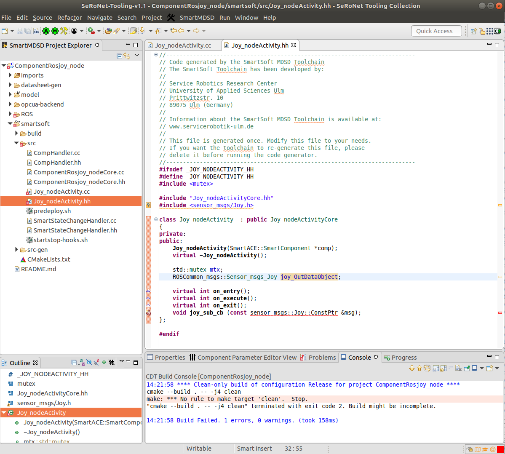
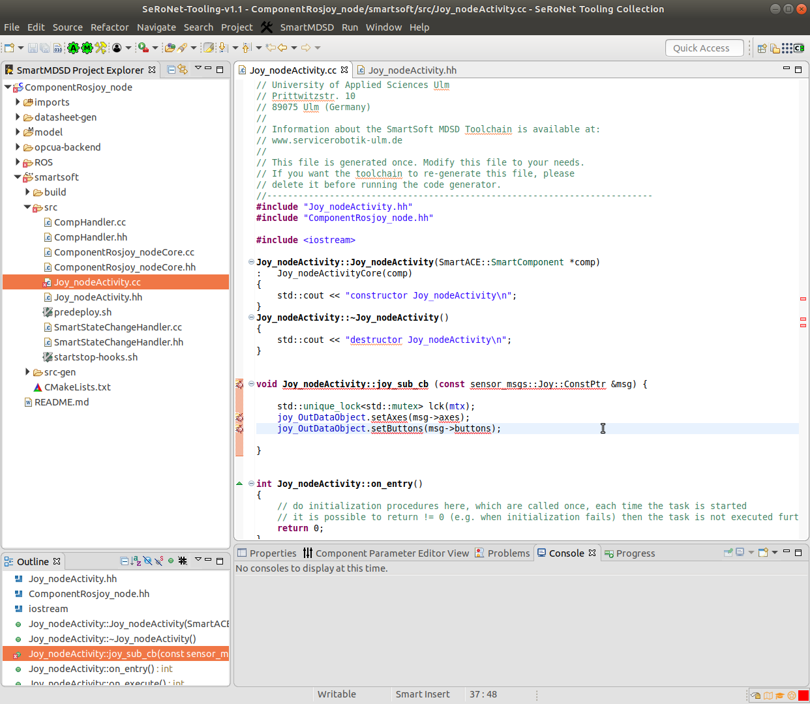
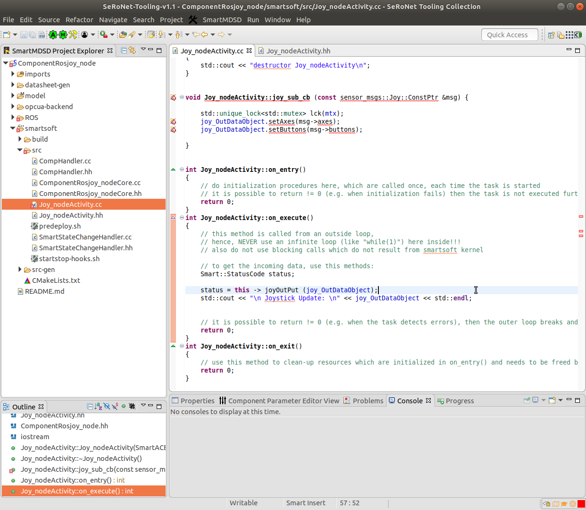

# ROS Publisher relay to SeRoNet network

This tutorial shows how to use the [SeRoNet Mixed port features](https://github.com/seronet-project/SeRoNet-Tooling-ROS-Mixed-Port) to connect a **ROS node model** from the [SeRoNet ROS tooling collection](https://github.com/ipa320/ros-model/) to the SeRoNet network. For this case, we use a **ROS publisher** as interface to be relayed and explain the resulted model, the C++ code that will be auto generated and point the code parts where the user can implement further functionalities.

Some of the concepts explained in [SeRoNet Tooling Collection - ROS support](../../README.md) are required to perform this tutorial. A previous default setup of the workspace is necessary to follow the instructions of the tutorial: [WORKSPACE SETUP](../ROSMixedPortTutorials_WSsetup.md).

### System overview


### Required packages

**Domain Models projects::**

- [CommBasicObjects](https://github.com/Servicerobotics-Ulm/DomainModelsRepositories/tree/master/CommBasicObjects)

- [ROSRos_core](../../DomainRosModelsRepositories/ROSRos_core)

- [ROSCommon_msgs](../../DomainRosModelsRepositories/ROSCommon_msgs)

**ROS projects:**

- [de.fraunhofer.ipa.ros.communication.objects](https://github.com/ipa320/RosCommonObjects/tree/master/de.fraunhofer.ipa.ros.communication.objects)

- [joy](joy)

**Component model projects:**

- ComponentRosjoy_node (it will be created in this tutorial)

### ROS components

For this example we selected one of the most common ROS drivers, the [joy package](http://wiki.ros.org/joy), a package that requires as dependency the [sensor_msgs](http://wiki.ros.org/sensor_msgs). As it is part of the common ROS msgs the required dependencies were automatically loaded to your workspace whiting the project **de.fraunhofer.ipa.ros.communication.objects**.

The ROS tooling project associated to this ROS driver is delivered within this repository, you can import it using the Eclipse menu: **File** => **Import** => **General** => **Existing Projects into Workspace** and click the **Next** button. In the following window, click the **Browse...** button and select your local folder where you cloned the examples repository and choose the project **SeRoNet-examples/SeRoNet-Tooling-ROS-Mixed-Port/ROS-MixedPort-Examples/ROSPublisher_examples/joy**. Complete the import by clicking the **Finish** button. If you navigate through the **joy** package and open the [representation file](https://www.eclipse.org/sirius/doc/user/general/Aird_Editor.html) you can get an overview o the model.


To get further information about how to create the model using the ROS developer tooling please visit the [ROS tooling documentation](https://github.com/ipa320/ros-model#tutorials).

### SeRoNet components

By default the tooling automatically auto generates the corresponding component interface (a generic model of a component) of all the nodes on your ROS project. The auto generated components are always located under a new folder called *components/*. This model is the bridge from ROS to other frameworks. For the case of SeRoNet the tooling includes a special function that can be activated by a right-click on the file an choosing the option *Generate ROS-SeRoNet Mixed Port*.


The result of this call is a *rospoolinterface* file. Complementarity and to make easier the relay of interfaces we incorporated an extra help function that automatically relays one of the ROS interfaces. The previous function through its pop-up dialog guides the user to generates not only the *rospoolinterface* model but also a suggestion of a SeRoNet component with a ROS mixed Port, for this example we will use the publisher for the topic **joy** . The resulted files will be generated under the folder *src-gen/SeRoNetComponent*.

These two files can be used to create a new SeRoNet component. First, the perspective have to be changed to the *Component Supplier* one. This perspective will add the option to [create a new Component Project](https://wiki.servicerobotik-ulm.de/tutorials:develop-your-first-component:start). Using the help dialog menu you can give the following description to your new component project:

- Project name: **ComponentRosjoy_node** (it is very important that the name of the project is the same than the name of the component, by default the ROS->SeRoNet converter set as component name **ComponentRos**MyRosNodeName )
- Model type: **ComponentDefinition** and **ComponentDatasheet**
- Dependencies: **ROSCommon_msgs** and **CommBasicObjects**


Once the *Component Project* is created switch again to the ROS developer perspective and move the two previously auto-generated files: *joy/src-gen/SeRoNetComponent/ComponentRosjoy_node.component* and *joy/src-gen/SeRoNetComponent/joy_node.gateway.rosinterfacespool* to the folder:  *ComponentRosjoy_node/model*.

The next figure shows the resulted SeRoNet component:


### Code implementation

In this section, we will adapt the auto generated C++ code to transform the incoming  ROS message update from a */joy* ROS topic publisher (through the port *joy_sub*) into a SeRoNet communication object and push this object to the SeRoNet output  port *joyOut*.

In case the *AutoCodeGeneration*  button is disabled, you can select your project from the project Explorer  and press the *RunCodeGeneration*   , these two buttons are only available for the *Component Supplier* perspective.

The code generator will create 3 folders to hold the C++ code implementation of your component:

- ROS : this is the code related to the ROS Mixed Port. For this concrete case, it holds the implementtion of the ROS Subscriber (*joy_sub* Port) to the */joy* topic publisher and its Callback function.
- smartsoft: this folder contains the code associated to the SeRoNet plain port and body of the component. For this example, it holds the implementation of the Push Port *joyOut* and the activity *joy_nodeActivity*

- opcua-backend: this is the code related to the OPC UA backend for the SeRoNet plain port. For this concrete example this code is not relevant.

For the ROS Mixed components the code generator is designed to completely implement the ports and prepare the Activity classes to be completed manually. This approach reduces considerably the integration effort for the user, who can concentrate on a particular area of the code to implement the logic of the component, consistently with the implementation of [SeRoNet plain components](../../../SeRoNet-Tooling-Hello-World/#creating-two-new-example-components).

That means that the user should be mostly interested on the code related  to the activity, which can be found under *smartsoft/src*. There you we can find for this example the header file (*smartsoft/src/Joy_nodeActivity.hh*) and the source file (*smartsoft/src/Joy_nodeActivity.cc*).

To protect the shared data and avoid conflicts from being simultaneously accessed by different threads we recomment the use of the [C++ library mutex](http://www.cplusplus.com/reference/mutex/mutex/). We will also need a public variable *joy_OutDataObject* to hold the data information (type *ROSCommon_msgs::Sensor_msgs_Joy* ) got by the input port. That means for the header file:



The source code of the *Joy_nodeActivity*  (*smartsoft/src/Joy_nodeActivity.cc*) contains the method *joy_sub_cb* which getting as input the message that ROS publishes  (type *sensor_msgs/Joy*) updates consequently the variable *joy_OutDataObject* (type *ROSCommon_msgs::Sensor_msgs_Joy* ) to be published to the SeRoNet network:



Finally the on_execute implementation must be updated to send to the output port *joyOut* the updated message *joy_OutDataObject*, to facilitate the debug of the software we recommended to add also a print instruction:



--> [Solution code](ComponentRosjoy_node) :wink:

### Execution

This section requires a proper installation of the SeRoNet backend and the correct setup  of the workspaces (see [SeRoNet workspace setup](../ROSMixedPortTutorials_WSsetup.md))

The first step, before we execute the code, is build the software. Unfortunately, the ROS build environment is not well supported by Eclipse which means that for the ROS Mixed Port examples the code have to be compiled using a terminal. 

```
source /opt/ros/*DISTRO*/setup.bash
cd *YourWSPath*/ComponentRosjoy_node
cd smartsoft
mkdir build
cd build
cmake ..
make
```

The previous commands have to create a SeRoNet executable file for the *ComponentRosjoy_node* under the folder *$SMART_ROOT_ACE/bin*, which execution will create a ROS subscriber to the  */joy* publisher and push the message information to the SeRoNet middle ware.

Before starting the software, it is required connect physically a Linux compatible joystick component device to your system. You can check if your joystick device has been recognized using the following command:
```
ls /dev/input/js0
```

Then , as usual, open a new terminal window and start the ROS master:

```
roscore
```

In a second terminal window execute ROS joy_node (see [ROS Linux Joystick Wiki](http://wiki.ros.org/joy/Tutorials/ConfiguringALinuxJoystick) for further information).
```
rosrun joy joy_node
```

And lastly, in a new terminal we have to start the *ACE Naming Service* daemon to allow the communication or the ACE side  and the our  created ComponentRosjoy_node as Follows:
```
cd $SMART_ROOT_ACE
./startSmartSoftNamingService
./bin/ComponentRosjoy_node
```

The window where the ComponentRosjoy_node has been started will print for each Joystick command its new status message: 


